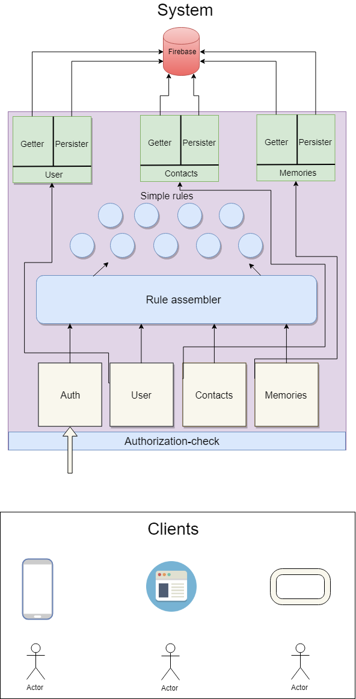

# Memory sharer



## Server API documentation
The basic url to the server is `to be added`

### Authorization
Authorization can currently be done by the following methods:
- Username and password

If the authorization is successful an jwt-token is received, containing the following:
- Expiration time
- The users guid

The token is to be added to each request against the API.

#### Route - Login 
`POST: /auth/login`

##### Parameters
| Parameter   | value                                      |
| ----------- |:------------------------------------------:|
| clientId    | An id that is distributed by the API-admin |
| password    | The users password.                        |
| username    | The users username                         |

##### Response
**200**
```js 
{
    token: '<auth key>'
}
```

**400**
```js 
{
    error: {
        code: 'INVALID_CLIENT_ID'
    }
}
```

**403**
```js 
{
    error: {
        code: 'LOGIN_FAILED'
    }
}
```

**404**

```js 
{
    error: {
        code: 'USER_DOES_NOT_EXISTS'
    }
}
```


### User

#### Route - Get User
`GET: /user`

##### Parameters
|Type      | Parameter     | value                 |
|---------:| -------------:|----------------------:|
|Head      | Authorization | `Bearer <auth token>` |

##### Response

**200**
```js
{
    name: 'Kristoffer',
    guid: "bjbsnjfhdfngjdf4541154dsfds"
    id: 'hgfisds44',
    email: 'kristoffer@email.com'
}
```
#### 404
```js
{
    error: {
        code: 'USER_DOES_NOT_EXISTS'   
    }
}
```

#### Route - Add User (Not protected)
`POST: /user`

##### Parameters
|Type      | Parameter   | value                   |
|---------:| ----------- |:-----------------------:|
|json      | username    | `'kristoffer'`          |
|json      | password    | `'*********'`           |
|json      | clientId    | `'client.id.se'`        |


##### Response
**200**
```json
{
   "guid": "<guid>"
}

```
**400**
```json
{
    "error: {
         code: 'INVALID_USERNAME' | 'INVALID_EMAIL' | INVALID_PASSWORD | INVALID_CLIENT_ID
    }
}
```

**403**
```json
{
    "error": {
         "code": "USERNAME_ALREADY_TAKEN"
    }
}
```

### Contacts 

#### Route Get contacts
`GET: /contacts`

##### Parameters
|Type      | Parameter     | value                 |
|---------:| -------------:|----------------------:|
|Head      | Authorization | `Bearer <auth token>` |

##### Response 

**200**
```json
[
    {
        "username": "contactname",
        "guid": "s4f754sd2fsfajfdsda54",
        "id": "-L2WrCY1G-N89gRxxXek",
        "email": "contact@email.com"
    },
    {
        "username": "contactname2",
        "guid": "4dfgdfgdfgfdg845453d",
        "id": "-L2lk7TNfL3WzGuyoyM1",
        "email": "contact2@email.com"            
    }
    ...
]
```

#### Route Add contact to user
`POST: /contacts`

This functionality should be changed so that the added contact must accept the adder. 

##### Parameters
|Type        | Parameter     | value                       |
|:-----------|:--------------|:----------------------------|
|Head        | Authorization | `Bearer <auth token>`       |
|json        | contactGuid   | `dsfhiuhsdf46574dfs7486sd4` |

##### Response
**200**
```json
{
    "contactList": [
        "dfks4sdfsdf854fdsfsd",
        "dsf4dsfg7sdr48g6vdg7fd6",
        "sd45gfd6f4ds68f54ds6f8s4",
        "dsfhiuhsdf46574dfs7486sd4"  // <-- New contact
    ]
}
```

##### 400
```json
"error" {
    "code": ALREADY_A_CONTACT
}
```

##### 404 
```json
{
    "error": {
         "code": USER_DOES_NOT_EXISTS | CONTACT_DOES_NOT_EXISTS
    }
}
```


### Memory

#### Route - Get memories sent by user.

`GET: /memories/sent`

##### Parameters
|Type        | Parameter     | value                       |
|:-----------|:--------------|:----------------------------|
|Head        | Authorization | `Bearer <auth token>`       |
|json        | contactGuid   | `dsfhiuhsdf46574dfs7486sd4` |

##### Response

**200**
```json 
[
    {
        "guid": "memory-1519512694957445",
        "filePath": "public\\images\\memory-1519512694957445.jpg",
        "message": "Hello, and look att this!",
        "recipients": [
            "1tb642H6453nD57R16by83Q5au6mw6E15",
            "5784ddff42H6453gdgweygtas7gh8dfsE"
        ],
        "sender": "Ceu0I78uW0RC52B5UtuiKe4K6vF5LNqt6"
    },
    {
        "guid": "memory-1519513401034576",
        "filePath": "public\\images\\memory-1519513401034576.jpg",
        "message": "Wat about a grasshopper for dinner?",
        "recipients": [
            "1tb642H6453nD57R16by83Q5au6mw6E15"
        ],
        "sender": "Ceu0I78uW0RC52B5UtuiKe4K6vF5LNqt6"
    }
]
```

#### Route - Get memory image
`GET: /image/?filePath=....`

##### Parameters
|Type                | Parameter     | value                                           |
|:-------------------|:--------------|:------------------------------------------------|
|Head                | Authorization | `Bearer <auth token>`                           |
|GET (query param)   | filePath      | `"public\\images\\memory-1519512694957445.jpg"` |


##### Response

**200**
```
image
``` 

##### 400
```
{
    "error": {
        "code": "INVALID_IMAGE" // The requested file does not exist or can not be accessed
    }
}
```

#### Route - Add memory
POST: `baseURL/memory`

##### Parameters
| Parameter   | value                 | format               |
| ----------- |:---------------------:| --------------------:|
| memory      | Image to be uploaded  | .png or .jpeg - file |
| recipients  | Array of user guids   | [..., ..., ..., ]    |
| sender      | A user guid           | .......              |
| message     | String (Optional      | 'Hello my friend'    |

#### Response

##### 200
```
{
    "failedToSendTo": []
}
``` 

##### 400
```
{
    error: {
        code: INVALID_IMAGE
    }
}
```
##### 404
```
{
    error: {
        code: USER_DOES_NOT_EXISTS
    }
}
```

### Delete memory

DELETE: `baseURL/memory/{id}`

#### Response

##### 200
Successfully deleted memory

##### 400
```
{
    error: {
        code: 'INVALID_ID'
    }
}
```


